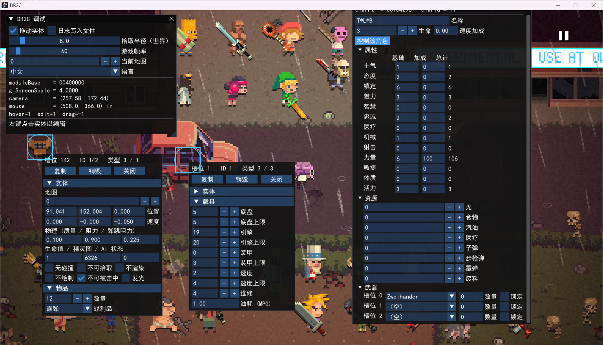

# DeathRoad to Canada Internal Overlay

一个基于 ImGui + MinHook 的 **DR2C 进程内覆盖层（Internal Overlay）**。

通过 Hook `opengl32!wglSwapBuffers`，在游戏自己的 OpenGL 上下文里绘制调试 / 编辑面板，需要注入器注入dll。可以在运行时查看并修改实体、角色、物品、车辆等数据。

界面支持**中英文实时切换**，语言选择会落盘到 DLL 同目录的 `.ini`。

---

## 功能一览

### 覆盖层
- Hook `wglSwapBuffers`，在游戏渲染帧上直接叠加 ImGui 界面
- 拦截游戏窗口的 `WndProc`，输入由 ImGui 优先消费
- 全部 32 位，与游戏同进程

### 实体（Thing）
- 鼠标悬停拾取实体，屏幕空间高亮框 / 圆环
- **按住左键拖拽**移动实体（世界坐标实时写回）
- **右键点击实体**打开编辑窗口
- 可编辑字段：
  - 地图 ID
  - 位置 / 速度
  - 物理参数（质量 / 摩擦 / 弹性）
  - 生命值 / 精灵 ID / AI 状态
  - 标志位：不碰撞、不可拾取、未看见、隐身、不受伤、发光
- 一键 **Clone** / **Destroy**

### 角色（type == 1）
- 姓名、生命、速度加成
- 13 项属性（基础值 / 加成值 / 合计）
- 8 项资源（食物、汽油、医疗、子弹、步枪弹、炮弹、废料…）
- 6 个武器槽：武器名下拉框（从游戏武器表读取）+ 堆叠数 + 锁定
- **Control Human** 一键把该实体设为当前操控角色

### 物品（type == 3, subtype == 1）
- 数量、掉落资源类型（下拉框，与资源名表一致）

### 车辆（type == 3, subtype == 3）
- 底盘 / 引擎 / 装甲 / 速度（当前值 + 上限）
- 修理值、MPG

### 其他
- 实时显示模块基址、屏幕缩放、相机坐标、鼠标坐标、悬停 / 编辑 / 拖拽槽位
- 可调拾取半径
- 可在面板里直接修改游戏帧率、当前地图层
- 可选日志输出到 DLL 同目录 `.log`



---

## 目录结构

```
.
├── CMakeLists.txt
├── dllmain.cpp            # DLL 入口：Hook wglSwapBuffers、挂接 WndProc
├── imgui_ui.cpp           # 覆盖层主逻辑：面板、拾取、拖拽、编辑器
├── imgui_ui.h
├── translation.cpp        # 中英文词条表与查表
├── translation.h
├── dr2c_memory.h          # 地址/指针读写封装（Address / Load / Store / AsFn…）
├── dr2c_offsets.h         # 游戏偏移与结构常量（唯一来源）
├── imgui-1.92.9b/         # Dear ImGui 源码 （自行下载）
└── MinHook/               # MinHook 头文件 + lib/MinHook.a
```

> 所有游戏偏移、结构大小、槽位数量、字符串长度**只在 `dr2c_offsets.h` 中声明**，其他文件一律通过 `Offset::*` 引用。

---

## 构建

### 环境要求
- **32 位 MinGW 工具链**（i686-w64-mingw32-g++ 等），CMake 会强制检查 `CMAKE_SIZEOF_VOID_P == 4`
- CMake ≥ 3.19
- C++17

### 步骤

```bash
cmake -B build -G "MinGW Makefiles" -DCMAKE_CXX_COMPILER=i686-w64-mingw32-g++
cmake --build build -j
```

产物：

```
build/bin/DR2CInternalOverlay.dll
```

编译选项：`-O2 -Wall -Wextra -fno-exceptions -fno-rtti`，静态链接 libgcc / libstdc++，因此运行时不依赖 MinGW 运行时 DLL。

---

## 使用

1. 将 `DR2CInternalOverlay.dll` 注入到游戏进程（任意注入方式均可）
2. 启动时 DLL 会等待 `opengl32.dll` 加载完成，然后 Hook `wglSwapBuffers`
3. 首次渲染时挂接游戏窗口，初始化 ImGui，界面即出现

### 快捷键

| 按键 | 功能 |
| --- | --- |
| `Insert` | 显示 / 隐藏调试面板 |
| 鼠标左键拖拽 | 移动悬停的实体（需先勾选 "Drag entity"） |
| 鼠标右键点击实体 | 打开实体编辑窗口 |

### 面板说明

- **Drag entity** — 开启拖拽模式
- **Log to file** — 每 30 帧写入一条状态日志
- **Pick radius (world)** — 鼠标拾取半径（世界单位）
- **Game FrameRate** — 直接调用游戏 `SetFrameRate`
- **Current Map** — 读写当前地图层
- **Language** — `English` / `中文`

---

## 语言与字体

- 词条以**英文原文**为 key（类似 Qt 的 `tr()`），使用 `Tr("...")` 取当前语言文本
- 未收录的 key 会原样返回英文，因此漏翻不会崩
- 中文依赖系统 CJK 字体，按以下顺序尝试加载：

  ```
  simhei.ttf → msyh.ttc → msyh.ttf → msyhl.ttc → Deng.ttf → simsun.ttc
  ```

- **未找到中文字体时，"中文"选项会被禁用**，避免出现方块字
- 语言设置保存在 **DLL 同目录**的 `.ini`：

  ```ini
  language=zh
  ```

- 日志（如启用）保存在 DLL 同目录的 `.log`

---

## 开发提示

### 地址与内存访问

`dr2c_memory.h` 提供统一入口，禁止裸指针乱飞：

```cpp
Address base = Addr(GetModuleHandleW(nullptr));
auto fn = AsFn<fn_GetCharacterData_t>(base + Offset::Fn::GetCharacterData);

std::uint16_t id = Load<std::uint16_t>(base + Offset::Thing::Id);
Store<std::uint8_t>(base + Offset::Thing::MapId, 3);
```

### 实体地址

```cpp
Address EntityAddress(SlotIndex slot) {
    return g_moduleBase + Offset::Global::ThingPool
         + slot * Offset::Thing::Stride;
}
```

### 写回实体的两种方式

- **拖拽** / 编辑器中的逐字段修改 → `QueueEntityWrite(slot, entity, mask)`
- 下一帧 `ApplyPendingEntityWrite()` 会把写入同步回游戏内存，并立即回读刷新缓存

### ImGui 窗口 ID 稳定技巧

面板标题会随语言变化，因此所有 `Begin` / `OpenPopup` 使用 **`"显示名###固定ID"`** 形式：

```cpp
snprintf(buffer, sizeof(buffer), "%s###dr2c_entity_edit", Tr("Entity Edit"));
```

这样切换语言时窗口位置、大小、弹窗状态都不会丢。

---

## 已知限制

- 只 Hook 到当前活动窗口的 `WndProc`；若游戏重建窗口，需要重新注入
- CJK 字体来自系统字体目录，若系统无任何中文字体则只能使用英文界面

---

## 致谢

- [Dear ImGui](https://github.com/ocornut/imgui) — 界面库
- [MinHook](https://github.com/TsudaKageyu/minhook) — API Hook 库

---

## 免责声明

本项目仅用于**单机游戏调试、学习与个人存档研究**。请在自行承担风险的前提下使用。
